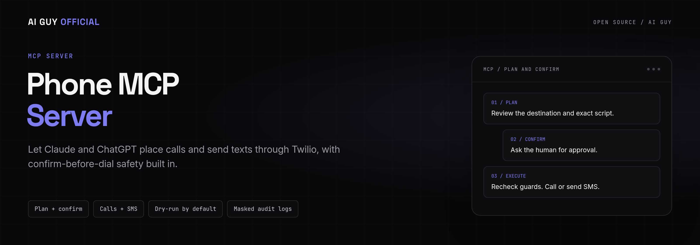
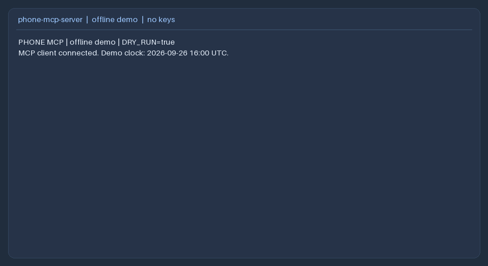
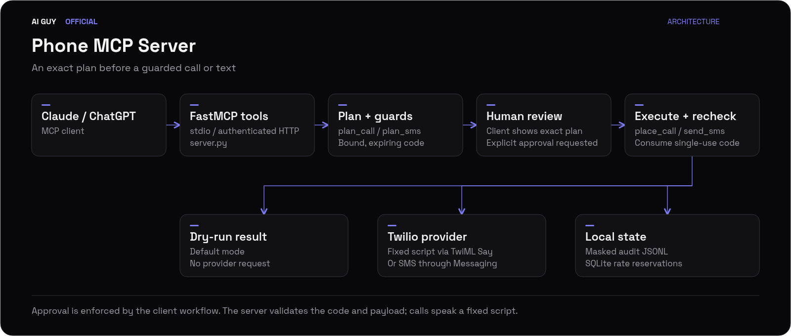

<p align="center">
  
</p>

<p align="center">
  <strong>Let Claude and ChatGPT place calls and send texts through Twilio, with confirm-before-dial safety built in.</strong>
</p>

<p align="center">
  <a href="https://github.com/jbrazy480/phone-mcp-server/actions/workflows/ci.yml"></a>
  <a href="LICENSE"></a>
  <a href="https://www.python.org/downloads/"></a>
  <a href="https://www.twilio.com/docs/voice"></a>
  <a href="https://modelcontextprotocol.io/"></a>
  <br>
  <a href="https://www.skool.com/evolving-ai-hub?utm_source=github&utm_medium=readme&utm_campaign=phone-mcp-server&utm_content=community"></a>
  <a href="https://rizzdial.com/booked?utm_source=github&utm_medium=readme&utm_campaign=phone-mcp-server&utm_content=done-for-you"></a>
</p>

<p align="center">
  <a href="https://www.skool.com/evolving-ai-hub?utm_source=github&utm_medium=readme&utm_campaign=phone-mcp-server&utm_content=community"></a>
  <a href="https://rizzdial.com/booked?utm_source=github&utm_medium=readme&utm_campaign=phone-mcp-server&utm_content=done-for-you"></a>
  <a href="https://aiguyofficial.com/resources?utm_source=github&utm_medium=readme&utm_campaign=phone-mcp-server&utm_content=resources"></a>
</p>

<p align="center">
  Run this yourself for free with the MIT starter below, learn in the Evolving AI Hub community, or book a call and have the RizzDial team set up AI calling for you.
</p>

## Demo

<p align="center">
  
</p>

<p align="center"><em>Plan a call and an SMS, confirm each with a one-time code, and watch a guard reject a disallowed destination, all offline with no API keys.</em></p>

## What it does

<table>
  <tr>
    <td width="33%">
      <strong>Plan before dial</strong><br>
      <code>plan_call</code> and <code>plan_sms</code> return the exact spoken script or SMS body plus a one-time confirmation code.
    </td>
    <td width="33%">
      <strong>Confirm before dial</strong><br>
      <code>place_call</code> and <code>send_sms</code> take only that code. Codes are single-use, expire in five minutes, and are hash-verified.
    </td>
    <td width="33%">
      <strong>Dry-run by default</strong><br>
      <code>DRY_RUN=true</code> out of the box. No Twilio request is made, including read tools, until you turn it off.
    </td>
  </tr>
  <tr>
    <td width="33%">
      <strong>Destination guards</strong><br>
      Comma-separated allowlist with starred prefixes, plus an optional blocklist file. Blank allowlists deny everything.
    </td>
    <td width="33%">
      <strong>Calling window</strong><br>
      Calls are only placed inside 08:00 to 21:00 local time, checked against a bundled US area-code map.
    </td>
    <td width="33%">
      <strong>Rate limits</strong><br>
      A shared per-hour limit for calls and SMS, persisted in SQLite so it survives restarts.
    </td>
  </tr>
  <tr>
    <td width="33%">
      <strong>Masked audit log</strong><br>
      Every plan and execution writes a JSONL record with no bodies, codes, or credentials.
    </td>
    <td width="33%">
      <strong>stdio or HTTP</strong><br>
      Runs over stdio for desktop clients, or streamable HTTP with static bearer or OAuth resource-server auth.
    </td>
    <td width="33%">
      <strong>Config doctor</strong><br>
      <code>python -m phone_mcp.check</code> validates settings, timezone data, and storage without touching Twilio.
    </td>
  </tr>
</table>

## Who this is for

Developers connecting a personal Claude or ChatGPT workflow to their own Twilio account. This is a single-owner starter, not a multi-tenant service or a conversational voice agent. The `message_or_goal` argument is spoken literally: write a finished script before planning the call.

## Quickstart

### Try the 60-second offline demo, no keys

From this directory, with Python 3.11 or later installed:

```bash
python3 -m venv .venv
source .venv/bin/activate
python -m pip install -r requirements-dev.txt
python -m phone_mcp.demo
python -m phone_mcp.check
```

On Windows, activate with `.venv\Scripts\Activate.ps1`. The demo uses the SDK's in-memory client/session utility and temporary storage. It fixes the clock inside the allowed window, simulates a human confirmation, and demonstrates an allowlist rejection. It ignores your `.env`, so it cannot place a real call.

### Place real phone calls or send real SMS

You need a Twilio account, an appropriate Twilio sender number, and a recipient who has given the required consent. No OpenAI API key is used by this server. Your MCP client supplies the assistant. No audio bridge is present.

```bash
cp .env.example .env
# Edit .env locally:
# DRY_RUN=false
# ALLOWED_NUMBERS=your consenting recipient in E.164
# TWILIO_ACCOUNT_SID=your account SID
# TWILIO_AUTH_TOKEN=your auth token
# TWILIO_FROM_NUMBER=your Twilio number in E.164
# CALLER_NAME=your actual name or organization
python -m phone_mcp.check
python -m phone_mcp
```

Connect a client using the instructions below. Ask it to plan a call, review the exact destination and spoken script, then explicitly approve that plan. A fresh plan is required if the script changes. Trial accounts and messaging registration can impose additional provider restrictions; consult [Twilio's trial guide](https://www.twilio.com/docs/usage/tutorials/how-to-use-your-free-trial-account).

Calls use [inline TwiML](https://www.twilio.com/docs/voice/api/call-resource#create-a-call) and [Say](https://www.twilio.com/docs/voice/twiml/say), without a callback URL or `<Gather>`. No Twilio webhook is exposed, so webhook signature validation is not applicable. If you add an inbound webhook, validate it with `twilio.request_validator.RequestValidator` before handling data. A tunnel is needed only for a remote MCP client, not for Twilio to speak the script.

<details>
<summary>Connect your MCP client</summary>

### Claude Desktop

Install the package into the virtual environment:

```bash
python -m pip install -e .
```

Merge this into `claude_desktop_config.json`, replacing all paths with absolute paths to your checkout and environment:

```json
{
  "mcpServers": {
    "phone": {
      "command": "/absolute/path/phone-mcp-server/.venv/bin/python",
      "args": ["-m", "phone_mcp"],
      "env": {
        "POLICY_FILE": "/absolute/path/phone-mcp-server/policy.yaml",
        "AUDIT_FILE": "/absolute/path/phone-mcp-server/data/audit.jsonl",
        "STATE_FILE": "/absolute/path/phone-mcp-server/data/state.sqlite3",
        "DRY_RUN": "true",
        "ALLOWED_NUMBERS": "+12125550123"
      }
    }
  }
}
```

Create that `policy.yaml` first using the example. On Windows use the absolute `.venv\Scripts\python.exe` path. Restart Claude Desktop after updating its configuration. Keep credentials in your local environment or private local configuration. Do not assume a desktop client's working directory will load this checkout's `.env`.

### Claude Code

In this checkout with the virtual environment active:

```bash
python -m pip install -e .
claude mcp add phone -- python -m phone_mcp
```

If launching from another directory, configure absolute storage and policy paths as above. Ask Claude to read `phone://policy` and use `outbound_call_checklist` before planning a call.

### Streamable HTTP and MCP Inspector

HTTP listens on loopback at `http://127.0.0.1:8000/mcp`:

```bash
# Generate locally; store the result privately as MCP_HTTP_TOKEN in .env.
python -c 'import secrets; print(secrets.token_urlsafe(32))'
python -m phone_mcp --http --port 8000
```

**Never expose HTTP without auth.** Startup warns if both bearer and OAuth auth are absent. Keep tokens out of URLs, browser history, source control, and screenshots. Use HTTPS for remote traffic. Run a single server process so confirmation codes stay in one memory store.

For stdio inspection:

```bash
npx @modelcontextprotocol/inspector python -m phone_mcp
```

For HTTP, start Inspector without a server command, choose Streamable HTTP and `/mcp`, and configure the Authorization header as `Bearer YOUR_LOCAL_TOKEN`:

```bash
npx @modelcontextprotocol/inspector
```

To create an HTTPS tunnel after configuring auth:

```bash
ngrok http 8000
# Alternative:
# cloudflared tunnel --url http://127.0.0.1:8000
```

Set `MCP_PUBLIC_URL=https://YOUR-TUNNEL-HOST/mcp` and restart the server so the SDK accepts that host. A tunnel provides transport, not user authentication. The HTTP implementation retains the SDK's host/origin checks.

### ChatGPT remote MCP with OAuth

ChatGPT's remote MCP connection uses OAuth for user authentication; do not assume it accepts a custom static API key. See the [official authentication guide](https://developers.openai.com/plugins/build/auth) and [connection quickstart](https://developers.openai.com/plugins/build/app-quickstart).

This repo implements the OAuth **resource server**. You must supply an external authorization server with OAuth metadata, authorization-code flow with PKCE, and client registration compatible with ChatGPT. It is not an identity provider.

1. Configure that provider to issue RS256 JWT access tokens with an `aud` equal to your exact public `/mcp` URL, `iss` equal to the issuer URL, `sub`, `exp`, and `scope` containing `phone:use`. Restrict authorization to the intended owner; that scope grants access to this Twilio account's tools.
2. Set `OAUTH_ISSUER`, `OAUTH_JWKS_URL`, and `MCP_PUBLIC_URL` in `.env`. Leave `MCP_HTTP_TOKEN` empty. Start with `DRY_RUN=true`.
3. Run `python -m phone_mcp --http --port 8000` and `ngrok http 8000`. Use a stable tunnel hostname or update the identity provider audience and server URL when it changes.
4. In ChatGPT's developer-mode MCP/app settings, add the public HTTPS `/mcp` URL and select OAuth. Register the callback URI shown by ChatGPT with your identity provider, then sign in as the authorized owner.
5. Inspect `phone://policy`, plan an SMS, and explicitly approve the dry-run plan before enabling live mode.

The SDK publishes `/.well-known/oauth-protected-resource/mcp` and advertises it in unauthenticated challenges. The server validates signature, issuer, audience, expiry, and required scope. OAuth setup depends on your provider and ChatGPT account/workspace access. Static bearer auth remains useful for Inspector and other clients supporting custom Authorization headers.

</details>

## How it works

<p align="center">
  
</p>

1. Claude or ChatGPT calls `plan_call` or `plan_sms`, which checks destination, timing, length, and rate guards before returning a plan and a one-time code.
2. A human reviews the exact spoken script or SMS body in the client and approves it.
3. `place_call` or `send_sms` accepts only that code, re-checks the guards, and consumes the code so it cannot be replayed.
4. In dry-run mode the server stops there. In live mode it calls Twilio to speak the script or send the message.
5. Every plan and execution writes a masked JSONL audit record, and rate reservations persist in SQLite.

`PhoneService` accepts an injected `PhoneProvider` and clock, so tests use a fake provider instead of the network. The SDK's installed API was inspected during development, including `FastMCP.streamable_http_app()` and `create_connected_server_and_client_session`; the dependency floor is the verified SDK version.

### How does confirmation prevent accidental calls?

`plan_call(to, message_or_goal, voice="alice")` and `plan_sms(to, body)` return a human-readable plan, a short random code, expiry, and SHA-256 payload hash. The exact payload includes action, destination, final text, voice, and dry-run mode. `place_call(confirmation_code)` and `send_sms(confirmation_code)` accept only the code. Codes expire after five minutes and are consumed even on a failed execution attempt. The payload is immutable and its hash is verified before use.

The server instructs the assistant to obtain human approval, but a code is a capability, not proof that a human clicked approve. A client can invoke both tools. Keep client approval controls enabled and treat prompt injection as a risk. For enforcement independent of the model, add an out-of-band approval UI before deploying beyond a trusted owner.

Rate limits count execute attempts across calls and SMS, including dry-runs and uncertain provider failures. They persist across restarts in SQLite. Plans check the limit but do not reserve slots. Execution reserves atomically before dispatch. Pending plans exist only in memory; restarting invalidates them. Failed provider requests are never automatically retried because the delivery outcome may be unknown.

### How do I inspect delivery or troubleshoot setup?

Use `get_call_status(call_sid)`, `list_recent_calls(limit=10)`, or `list_recent_messages(limit=10)`. The list limit is bounded from 1 to 100. Live reads query your Twilio account, returning SIDs/statuses without bodies or destinations. Dry-run reads return no remote records and make no requests.

Run `python -m phone_mcp.check` to validate configuration, timezone availability, blocklist, and writable audit/state storage without contacting Twilio. It does not verify credential validity, number ownership, consent, or delivery. Runtime audit data stays under ignored `data/`; records omit bodies, codes, and credentials and keep only the destination's final digits. Protect the directory and define your own retention policy.

## Configuration

Copy `policy.example.yaml` to `policy.yaml` if desired. Configuration loads `.env` without overriding existing process variables, reads YAML, then applies environment variables over YAML. YAML keys use the lowercase names shown in the example. Unknown keys and invalid values stop startup. Relative paths resolve from the server working directory; use absolute paths for desktop clients.

| Environment variable | Default | Purpose |
| --- | --- | --- |
| `DRY_RUN` | `true` | No Twilio requests, including read tools |
| `ALLOWED_NUMBERS` | empty, deny all | Comma-separated exact E.164 numbers or starred prefixes such as `+1212*` |
| `BLOCKLIST_FILE` | unset | Text file of exact numbers/starred prefixes; comments start with `#` |
| `MAX_PER_HOUR` | `5` | Rolling shared call/SMS attempt limit, persisted in SQLite |
| `MAX_MESSAGE_LENGTH` | `1000` | Character limit including the spoken disclosure |
| `CALLER_NAME` | `your assistant` | Identity in the mandatory automated-call disclosure |
| `AUDIT_FILE` | `data/audit.jsonl` | Masked plan/execute audit records |
| `STATE_FILE` | `data/state.sqlite3` | Persistent rate reservations |
| `TWILIO_ACCOUNT_SID` | empty | Live Twilio account |
| `TWILIO_AUTH_TOKEN` | empty | Live credential, never include in source control |
| `TWILIO_FROM_NUMBER` | empty | E.164 Twilio sender |
| `MCP_HTTP_TOKEN` | empty | Static bearer token; mutually exclusive with OAuth |
| `MCP_PUBLIC_URL` | empty | Public HTTPS resource URL including `/mcp`; permits its exact host |
| `OAUTH_ISSUER` | empty | External OAuth issuer URL, exact value including trailing slash if applicable |
| `OAUTH_JWKS_URL` | empty | HTTPS signing-key endpoint for RS256 tokens |
| `POLICY_FILE` | `policy.yaml` if present | Optional YAML path; an explicitly configured missing file is an error |

The blocklist is read again at execution. Other policy changes require a restart, which invalidates pending codes. Blank allowlists deny everything. Blocklists take precedence. Prefixes require a trailing `*`; an unstarred number matches only itself.

Calls require all candidate recipient zones to be within **08:00 inclusive to 21:00 exclusive**. The bundled [area-code map](phone_mcp/area_codes.json) covers selected US geographic NPAs and rejects unknown, toll-free, and non-US destinations for calls. SMS still requires E.164, allowlist, blocklist, size, confirmation, and rate checks, but does not use the calling window. See [map maintenance and limitations](docs/timezones.md). An area code cannot prove a mobile recipient's current location.

The disclosure is always prepended: `This is an automated call from ...`. Supported voice values are `alice`, `man`, and `woman`. The requested `alice` default uses Twilio's compatibility handling; see [Twilio's voice documentation](https://www.twilio.com/docs/voice/twiml/say).

## Testing

```bash
python -m pip install -r requirements-dev.txt
python -m pytest -q
python -m phone_mcp.demo
python scripts/make_demo_gif.py
```

94 tests pass offline with no network access and no API keys. They cover MCP registration/schemas/resources/prompts, confirmation binding, expiry, replay and concurrency, destination and timing guards, rate persistence, dry-run/live behavior with a fake, HTTP authentication, OAuth verification, audit masking, and the demo. CI runs the same offline checks on Python 3.11, 3.12, and 3.13.

## Compliance note (not legal advice)

Calling real people with automated or AI voices is regulated. The FCC has confirmed that AI-generated voices fall within the TCPA's artificial or prerecorded voice restrictions; see the [FCC ruling](https://docs.fcc.gov/public/attachments/FCC-24-17A1.pdf). Required consent, identification, opt-out handling, messaging rules, and applicable federal/state requirements depend on the situation. These software guards do not establish consent, perform DNC screening, or guarantee legal compliance. Consult qualified counsel before live outreach.

## How does this compare with other approaches?

| Approach | What you get | What you maintain |
| --- | --- | --- |
| This MIT starter | MCP tools, explicit plans, local guards, tests | Twilio account, hosting, auth, policies, compliance |
| Build from scratch | Your chosen behavior and architecture | MCP transport, provider integration, guards, testing, operations |
| Hosted platform | Managed product and supported workflows | Vendor selection, configuration, consent and business process |

## Want this done for you?

This starter is built for a developer running their own Twilio account for themselves. If you run an agency, a local business, or a sales team and want AI calling set up and managed instead of self-hosted, the RizzDial team can set that up for you on a commercial platform.

On [RizzDial](https://rizzdial.com/mcp?utm_source=github&utm_medium=readme&utm_campaign=phone-mcp-server&utm_content=product), the team sets up AI voice agents and AI calling for agencies and GoHighLevel users, including predictive, power, and parallel dialing, answering machine detection, a built-in CRM plus GoHighLevel, HubSpot, and Salesforce integrations, and an MCP connection so Claude and ChatGPT can drive it the same way this starter does.

[See the RizzDial MCP product page](https://rizzdial.com/mcp?utm_source=github&utm_medium=readme&utm_campaign=phone-mcp-server&utm_content=product) or [book a call](https://rizzdial.com/booked?utm_source=github&utm_medium=readme&utm_campaign=phone-mcp-server&utm_content=done-for-you) to talk it through.

## FAQ

### Is this free?

Yes. This starter is MIT licensed and free to run on your own Twilio account. You pay Twilio for the calls and messages you send, not for the code.

### Is RizzDial open source?

No. RizzDial is a separate commercial platform. This starter is the MIT-licensed part; RizzDial is not open source.

### Can it hold a conversation on the phone?

No. It speaks a fixed script using Twilio's text-to-speech. It does not listen, record, gather replies, or connect an audio model.

### Can I call any international number?

Calls require a supported US geographic area code. SMS can target E.164 destinations allowed by policy and Twilio, subject to applicable messaging rules.

### Does dry-run bypass the safety guards?

No. It uses the same validation and confirmation flow and consumes a rate reservation, but never creates a Twilio client or sends a provider request.

### What if the provider times out?

The confirmation code remains consumed and the attempt still counts. Check the Twilio console or recent-call/message tools before deciding whether a new plan is appropriate.

### Can multiple people share one HTTP server?

This is a single-owner starter. A bearer token or authorized OAuth identity can access the shared Twilio account and pending codes. Add per-user ownership, authorization, isolated state, and operational controls before multi-user deployment.

### How do I get help?

Ask in the [Evolving AI Hub](https://www.skool.com/evolving-ai-hub?utm_source=github&utm_medium=readme&utm_campaign=phone-mcp-server&utm_content=community), James Hill's free Skool community, or open an issue on this repo.

## Going further

<p align="center">
  <a href="https://www.skool.com/evolving-ai-hub?utm_source=github&utm_medium=readme&utm_campaign=phone-mcp-server&utm_content=community"></a>
  <a href="https://rizzdial.com/booked?utm_source=github&utm_medium=readme&utm_campaign=phone-mcp-server&utm_content=done-for-you"></a>
  <a href="https://aiguyofficial.com/resources?utm_source=github&utm_medium=readme&utm_campaign=phone-mcp-server&utm_content=resources"></a>
</p>

## License

[MIT](LICENSE), starter code only. RizzDial is a separate commercial platform.

Built by [James Hill (The AI Guy)](https://aiguyofficial.com?utm_source=github&utm_medium=readme&utm_campaign=phone-mcp-server&utm_content=author).

More free starters:

- [AI Receptionist](https://github.com/jbrazy480/ai-receptionist)
- [AI Cold Calling Agent](https://github.com/jbrazy480/ai-cold-calling-agent)
- [Voice Agent Prompts](https://github.com/jbrazy480/voice-agent-prompts)
- [TCPA Compliance Checklist](https://github.com/jbrazy480/tcpa-compliance-checklist)
