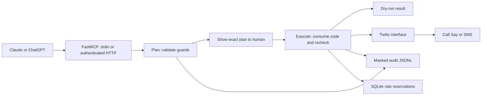
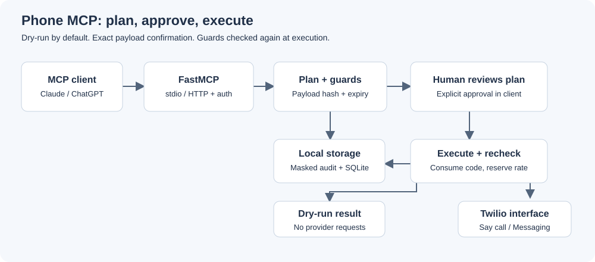

# Phone MCP server: open source Twilio calls and SMS for Claude and ChatGPT

**Phone MCP server is an MIT starter that lets MCP clients plan, confirm, and send guarded phone calls and SMS through Twilio.**

[](https://github.com/jbrazy480/phone-mcp-server/actions/workflows/ci.yml)
[](LICENSE)
[](https://www.python.org/downloads/)
[](https://aiguyofficial.com/resources?utm_source=github&utm_medium=readme&utm_campaign=phone-mcp-server)


## What it does

- Exposes the official Python MCP SDK's FastMCP tools over stdio or streamable HTTP.
- Plans an exact call script or SMS body before returning a single-use confirmation code.
- Sends a call using inline TwiML `<Say>` or sends an SMS using Twilio Messaging.
- Defaults to dry-run, with destination guards, a calling window, rate limits, and masked audit logs.
- Includes `phone://policy`, an outbound checklist prompt, an offline demo, and a configuration doctor.
- Supports static bearer authentication or OAuth token verification for remote HTTP clients.

## Who this is for

Developers connecting a personal Claude or ChatGPT workflow to their own Twilio account. This is a single-owner starter, not a multi-tenant service or a conversational voice agent. The `message_or_goal` argument is spoken literally. Write a finished script before planning the call.

## Quickstart

### Try the 60-second offline demo, no keys

From this directory, with Python 3.11 or later installed:

```bash
python3 -m venv .venv
source .venv/bin/activate
python -m pip install -r requirements-dev.txt
python -m phone_mcp.demo
python -m phone_mcp.check
```

On Windows, activate with `.venv\Scripts\Activate.ps1`. The demo uses the SDK's in-memory client/session utility and temporary storage. It fixes the clock inside the allowed window, simulates a human confirmation, and demonstrates an allowlist rejection. It ignores your `.env`, so it cannot place a real call.

### Place real phone calls or send real SMS

You need a Twilio account, an appropriate Twilio sender number, and a recipient who has given the required consent. No OpenAI API key is used by this server. Your MCP client supplies the assistant. No audio bridge is present.

```bash
cp .env.example .env
# Edit .env locally:
# DRY_RUN=false
# ALLOWED_NUMBERS=your consenting recipient in E.164
# TWILIO_ACCOUNT_SID=your account SID
# TWILIO_AUTH_TOKEN=your auth token
# TWILIO_FROM_NUMBER=your Twilio number in E.164
# CALLER_NAME=your actual name or organization
python -m phone_mcp.check
python -m phone_mcp
```

Connect a client using the instructions below. Ask it to plan a call, review the exact destination and spoken script, then explicitly approve that plan. A fresh plan is required if the script changes. Trial accounts and messaging registration can impose additional provider restrictions; consult [Twilio's trial guide](https://www.twilio.com/docs/usage/tutorials/how-to-use-your-free-trial-account).

Calls use [inline TwiML](https://www.twilio.com/docs/voice/api/call-resource#create-a-call) and [Say](https://www.twilio.com/docs/voice/twiml/say), without a callback URL or `<Gather>`. No Twilio webhook is exposed, so webhook signature validation is not applicable. If you add an inbound webhook, validate it with `twilio.request_validator.RequestValidator` before handling data. A tunnel is needed only for a remote MCP client, not for Twilio to speak the script.

## Configuration

Copy `policy.example.yaml` to `policy.yaml` if desired. Configuration loads `.env` without overriding existing process variables, reads YAML, then applies environment variables over YAML. YAML keys use the lowercase names shown in the example. Unknown keys and invalid values stop startup. Relative paths resolve from the server working directory; use absolute paths for desktop clients.

| Environment variable | Default | Purpose |
| --- | --- | --- |
| `DRY_RUN` | `true` | No Twilio requests, including read tools |
| `ALLOWED_NUMBERS` | empty, deny all | Comma-separated exact E.164 numbers or starred prefixes such as `+1212*` |
| `BLOCKLIST_FILE` | unset | Text file of exact numbers/starred prefixes; comments start with `#` |
| `MAX_PER_HOUR` | `5` | Rolling shared call/SMS attempt limit, persisted in SQLite |
| `MAX_MESSAGE_LENGTH` | `1000` | Character limit including the spoken disclosure |
| `CALLER_NAME` | `your assistant` | Identity in the mandatory automated-call disclosure |
| `AUDIT_FILE` | `data/audit.jsonl` | Masked plan/execute audit records |
| `STATE_FILE` | `data/state.sqlite3` | Persistent rate reservations |
| `TWILIO_ACCOUNT_SID` | empty | Live Twilio account |
| `TWILIO_AUTH_TOKEN` | empty | Live credential, never include in source control |
| `TWILIO_FROM_NUMBER` | empty | E.164 Twilio sender |
| `MCP_HTTP_TOKEN` | empty | Static bearer token; mutually exclusive with OAuth |
| `MCP_PUBLIC_URL` | empty | Public HTTPS resource URL including `/mcp`; permits its exact host |
| `OAUTH_ISSUER` | empty | External OAuth issuer URL, exact value including trailing slash if applicable |
| `OAUTH_JWKS_URL` | empty | HTTPS signing-key endpoint for RS256 tokens |
| `POLICY_FILE` | `policy.yaml` if present | Optional YAML path; an explicitly configured missing file is an error |

The blocklist is read again at execution. Other policy changes require a restart, which invalidates pending codes. Blank allowlists deny everything. Blocklists take precedence. Prefixes require a trailing `*`; an unstarred number matches only itself.

Calls require all candidate recipient zones to be within **08:00 inclusive to 21:00 exclusive**. The bundled [area-code map](phone_mcp/area_codes.json) covers selected US geographic NPAs and rejects unknown, toll-free, and non-US destinations for calls. SMS still requires E.164, allowlist, blocklist, size, confirmation, and rate checks, but does not use the calling window. See [map maintenance and limitations](docs/timezones.md). An area code cannot prove a mobile recipient's current location.

The disclosure is always prepended: `This is an automated call from ...`. Supported voice values are `alice`, `man`, and `woman`. The requested `alice` default uses Twilio's compatibility handling; see [Twilio's voice documentation](https://www.twilio.com/docs/voice/twiml/say).

## Connect your MCP client

### Claude Desktop

Install the package into the virtual environment:

```bash
python -m pip install -e .
```

Merge this into `claude_desktop_config.json`, replacing all paths with absolute paths to your checkout and environment:

```json
{
  "mcpServers": {
    "phone": {
      "command": "/absolute/path/phone-mcp-server/.venv/bin/python",
      "args": ["-m", "phone_mcp"],
      "env": {
        "POLICY_FILE": "/absolute/path/phone-mcp-server/policy.yaml",
        "AUDIT_FILE": "/absolute/path/phone-mcp-server/data/audit.jsonl",
        "STATE_FILE": "/absolute/path/phone-mcp-server/data/state.sqlite3",
        "DRY_RUN": "true",
        "ALLOWED_NUMBERS": "+12125550123"
      }
    }
  }
}
```

Create that `policy.yaml` first using the example. On Windows use the absolute `.venv\Scripts\python.exe` path. Restart Claude Desktop after updating its configuration. Keep credentials in your local environment or private local configuration. Do not assume a desktop client's working directory will load this checkout's `.env`.

### Claude Code

In this checkout with the virtual environment active:

```bash
python -m pip install -e .
claude mcp add phone -- python -m phone_mcp
```

If launching from another directory, configure absolute storage and policy paths as above. Ask Claude to read `phone://policy` and use `outbound_call_checklist` before planning a call.

### Streamable HTTP and MCP Inspector

HTTP listens on loopback at `http://127.0.0.1:8000/mcp`:

```bash
# Generate locally; store the result privately as MCP_HTTP_TOKEN in .env.
python -c 'import secrets; print(secrets.token_urlsafe(32))'
python -m phone_mcp --http --port 8000
```

**Never expose HTTP without auth.** Startup warns if both bearer and OAuth auth are absent. Keep tokens out of URLs, browser history, source control, and screenshots. Use HTTPS for remote traffic. Run a single server process so confirmation codes stay in one memory store.

For stdio inspection:

```bash
npx @modelcontextprotocol/inspector python -m phone_mcp
```

For HTTP, start Inspector without a server command, choose Streamable HTTP and `/mcp`, and configure the Authorization header as `Bearer YOUR_LOCAL_TOKEN`:

```bash
npx @modelcontextprotocol/inspector
```

To create an HTTPS tunnel after configuring auth:

```bash
ngrok http 8000
# Alternative:
# cloudflared tunnel --url http://127.0.0.1:8000
```

Set `MCP_PUBLIC_URL=https://YOUR-TUNNEL-HOST/mcp` and restart the server so the SDK accepts that host. A tunnel provides transport, not user authentication. The HTTP implementation retains the SDK's host/origin checks.

### ChatGPT remote MCP with OAuth

ChatGPT's remote MCP connection uses OAuth for user authentication; do not assume it accepts a custom static API key. See the [official authentication guide](https://developers.openai.com/plugins/build/auth) and [connection quickstart](https://developers.openai.com/plugins/build/app-quickstart).

This repo implements the OAuth **resource server**. You must supply an external authorization server with OAuth metadata, authorization-code flow with PKCE, and client registration compatible with ChatGPT. It is not an identity provider.

1. Configure that provider to issue RS256 JWT access tokens with an `aud` equal to your exact public `/mcp` URL, `iss` equal to the issuer URL, `sub`, `exp`, and `scope` containing `phone:use`. Restrict authorization to the intended owner; that scope grants access to this Twilio account's tools.
2. Set `OAUTH_ISSUER`, `OAUTH_JWKS_URL`, and `MCP_PUBLIC_URL` in `.env`. Leave `MCP_HTTP_TOKEN` empty. Start with `DRY_RUN=true`.
3. Run `python -m phone_mcp --http --port 8000` and `ngrok http 8000`. Use a stable tunnel hostname or update the identity provider audience and server URL when it changes.
4. In ChatGPT's developer-mode MCP/app settings, add the public HTTPS `/mcp` URL and select OAuth. Register the callback URI shown by ChatGPT with your identity provider, then sign in as the authorized owner.
5. Inspect `phone://policy`, plan an SMS, and explicitly approve the dry-run plan before enabling live mode.

The SDK publishes `/.well-known/oauth-protected-resource/mcp` and advertises it in unauthenticated challenges. The server validates signature, issuer, audience, expiry, and required scope. OAuth setup depends on your provider and ChatGPT account/workspace access. Static bearer auth remains useful for Inspector and other clients supporting custom Authorization headers.

## Architecture





`PhoneService` accepts an injected `PhoneProvider` and clock. Tests use a fake provider. The SDK's installed API was inspected during development, including `FastMCP.streamable_http_app()` and `create_connected_server_and_client_session`; the dependency floor is the verified SDK version.

## How does confirmation prevent accidental calls?

`plan_call(to, message_or_goal, voice="alice")` and `plan_sms(to, body)` return a human-readable plan, a short random code, expiry, and SHA-256 payload hash. The exact payload includes action, destination, final text, voice, and dry-run mode. `place_call(confirmation_code)` and `send_sms(confirmation_code)` accept only the code. Codes expire after five minutes and are consumed even on a failed execution attempt. The payload is immutable and its hash is verified before use.

The server instructs the assistant to obtain human approval, but a code is a capability, not proof that a human clicked approve. A client can invoke both tools. Keep client approval controls enabled and treat prompt injection as a risk. For enforcement independent of the model, add an out-of-band approval UI before deploying beyond a trusted owner.

Rate limits count execute attempts across calls and SMS, including dry-runs and uncertain provider failures. They persist across restarts in SQLite. Plans check the limit but do not reserve slots. Execution reserves atomically before dispatch. Pending plans exist only in memory; restarting invalidates them. Failed provider requests are never automatically retried because the delivery outcome may be unknown.

## How do I inspect delivery or troubleshoot setup?

Use `get_call_status(call_sid)`, `list_recent_calls(limit=10)`, or `list_recent_messages(limit=10)`. The list limit is bounded from 1 to 100. Live reads query your Twilio account, returning SIDs/statuses without bodies or destinations. Dry-run reads return no remote records and make no requests.

Run `python -m phone_mcp.check` to validate configuration, timezone availability, blocklist, and writable audit/state storage without contacting Twilio. It does not verify credential validity, number ownership, consent, or delivery. Runtime audit data stays under ignored `data/`; records omit bodies, codes, and credentials and keep only the destination's final digits. Protect the directory and define your own retention policy.

## How much does it cost to run?

The starter is MIT licensed. Live calls, messages, numbers, and optional tunnels or identity services may incur charges. See [Twilio Voice pricing](https://www.twilio.com/en-us/voice/pricing), [Twilio Messaging pricing](https://www.twilio.com/en-us/messaging/pricing), and your chosen MCP client's subscription terms. The offline demo makes no paid provider requests.

## Testing

```bash
python -m pip install -r requirements-dev.txt
python -m pytest -q
python -m phone_mcp.demo
python scripts/make_demo_gif.py
```

Tests prohibit network connections and require no API keys. They cover MCP registration/schemas/resources/prompts, confirmation binding, expiry, replay and concurrency, destination and timing guards, rate persistence, dry-run/live behavior with a fake, HTTP authentication, OAuth verification, audit masking, and the demo. CI runs the same offline checks on supported Python versions.

## Compliance note (not legal advice)

Calling real people with automated or AI voices is regulated. The FCC has confirmed that AI-generated voices fall within the TCPA's artificial or prerecorded voice restrictions; see the [FCC ruling](https://docs.fcc.gov/public/attachments/FCC-24-17A1.pdf). Required consent, identification, opt-out handling, messaging rules, and applicable federal/state requirements depend on the situation. These software guards do not establish consent, perform DNC screening, or guarantee legal compliance. Consult qualified counsel before live outreach.

## How does this compare with other approaches?

| Approach | What you get | What you maintain |
| --- | --- | --- |
| This MIT starter | MCP tools, explicit plans, local guards, tests | Twilio account, hosting, auth, policies, compliance |
| Build from scratch | Your chosen behavior and architecture | MCP transport, provider integration, guards, testing, operations |
| Hosted platform | Managed product and supported workflows | Vendor selection, configuration, consent and business process |

## FAQ

### Can it hold a conversation on the phone?

No. It speaks a fixed script using Twilio's text-to-speech. It does not listen, record, gather replies, or connect an audio model.

### Can I call any international number?

Calls require a supported US geographic area code. SMS can target E.164 destinations allowed by policy and Twilio, subject to applicable messaging rules.

### Does dry-run bypass the safety guards?

No. It uses the same validation and confirmation flow and consumes a rate reservation, but never creates a Twilio client or sends a provider request.

### What if the provider times out?

The confirmation code remains consumed and the attempt still counts. Check the Twilio console or recent-call/message tools before deciding whether a new plan is appropriate.

### Can multiple people share one HTTP server?

This is a single-owner starter. A bearer token or authorized OAuth identity can access the shared Twilio account and pending codes. Add per-user ownership, authorization, isolated state, and operational controls before multi-user deployment.

## Going further

Free resources, templates and community: [AI Guy resources](https://aiguyofficial.com/resources?utm_source=github&utm_medium=readme&utm_campaign=phone-mcp-server).

RizzDial is a commercial AI calling platform that includes an MCP connection for Claude and ChatGPT. This repo is an MIT starter for running your own.

When you need this across many client numbers with a dialer and CRM built in, RizzDial is a commercial platform for that: [RizzDial MCP](https://rizzdial.com/mcp?utm_source=github&utm_medium=readme&utm_campaign=phone-mcp-server).

## License

[MIT](LICENSE), starter code only. RizzDial is a separate commercial platform.

Maintained by James Hill (The AI Guy).
